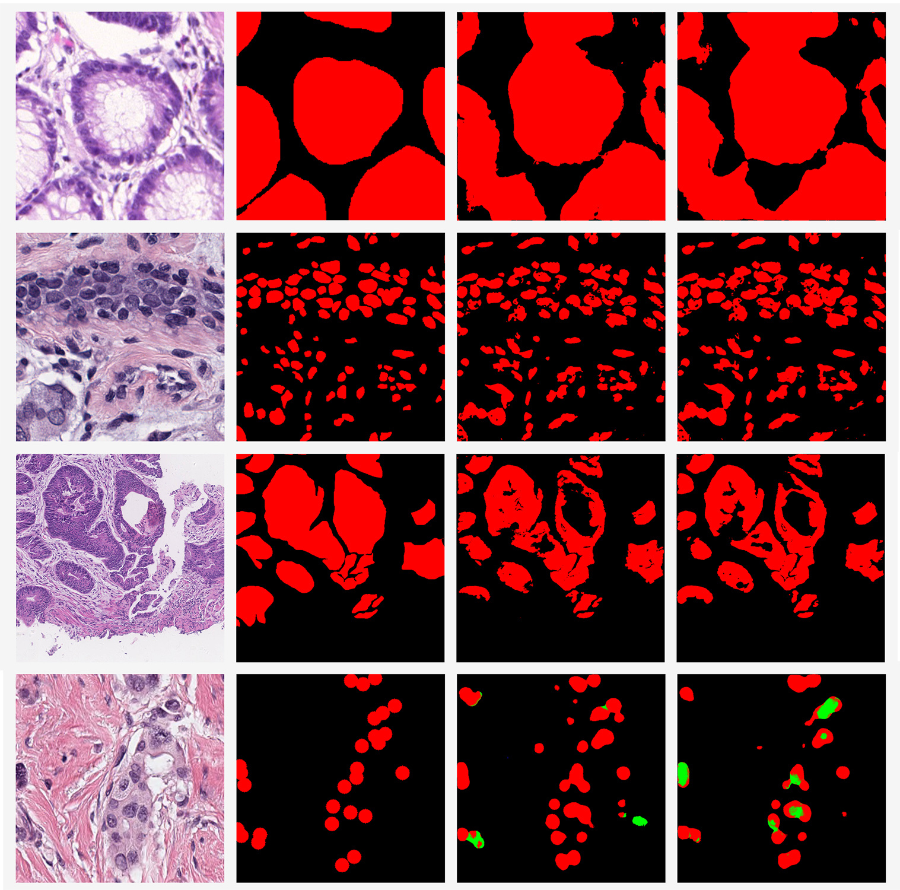

# MetaHistoSeg: A Python Framework for Meta Learning in Histopathology Image Segmentation
[](https://pytorch.org/)
[](https://opensource.org/licenses/BSD-3-Clause)

A Python framework that implements unique scenarios in both meta learning and instance based transfer learning 
in Histopathology Image Segmentation with a benchmark dataset for training and validating models 
on out-of-distribution performance across a range of cancer types.

### Paper Link
http://arxiv.org/abs/2109.14754

### Getting started
```bash
conda create -n <your_virtual_env> python=3.7
```
Create a virtual environment, activate it and install the requirements in [`requirements.txt`](requirements.txt).
```bash
conda activate <your_virtual_env>
pip install -r requirements.txt
```

#### Requirements
 - CUDA 9.0
 - Python 3.7
 - PyTorch 1.4.0
 - Torchvision 0.5.0
 - SimpleITK 2.1.1
 - opencv-python 4.5.3.56 
 - bs4 0.0.1
 - pathlib 1.0.1
 - pytest-shutil 1.7.0
 - scikit-image 0.18.3
 - tensorboardX 2.4

### Datasets [](https://creativecommons.org/licenses/by-nc/4.0/)

Download raw datasets by following the instructions on each host website.

| Host | Datasets | Size | Anatomical sites | Num of Segments | Local folder |
| :---: | :---: | :---: |  :---: |  :---: | :---: |
| https://digestpath2019.grand-challenge.org/ | digestPath | 250 |  colon | 2 | grand-challenge/digestPath/tissue-train-pos-v1 |
| https://gleason2019.grand-challenge.org/Register/ | gleason 2019 | 244 |  prostate | 6 | grand-challenge/gleason2019 |
| https://breastpathq.grand-challenge.org/Data/ | BreastPathQ | 154 |  breast | 4 | grand-challenge/BreastPathQ/breastpathq/datasets |
| https://monuseg.grand-challenge.org/Data/ | MoNuSeg | 30 |  Breast, kidney, Liver, Prostate, bladder, colon, stomach | 2 | grand-challenge/MoNuSeg Training Data |
| https://warwick.ac.uk/fac/sci/dcs/research/tia/glascontest/download | glandsegmentation | 161 |  colon | 2 | grand-challenge/Warwick QU Dataset (Released 2016_07_08) |


### Usage
For meta learning scenario with episodic sampling, use [`train_episode.py`](train_episode.py). e.g. when setting `gleason2019`, `BreastPathQ`, and `GlandSegmentation` as
the training tasks with equal probability and using `digestpath` as the validation task,
```bash
python train_episode.py /path/to/data --dataset gleason2019 BreastPathQ GlandSegmentation --dataset-prob 1/3 1/3 1/3 --validation-dataset digestpath --num-adaptations 1 --step-size 0.01 --meta-lr 0.0001 --max-iterations 200000 --batch-size 2 --batch-size-test 32 --meta-test-lr 0.001 --test-every 50 --use-cuda --num-workers 4 --device_ids "0,1,2,3" --output-folder /path/to/results
```
For transfer learning scenario with instance sampling, use [`train_batch.py`](train_batch.py). e.g. the same setup as above,
```bash
python train_batch.py /path/to/data --dataset gleason2019 BreastPathQ GlandSegmentation --dataset-prob 1/3 1/3 1/3 --validation-dataset digestpath --lr 0.0001 --max-iterations 200000 --batch-size 4 --batch-size-test 32 --meta-test-lr 0.001 --test-every 50 --use-cuda --num-workers 4 --device_ids "0,1,2,3" --output-folder /path/to/results
```
During inference, use [`refine.py`](refine.py). e.g. when new task is `MoNuSeg`,
```bash
python refine.py /path/to/data /export/medical_ai/ --dataset MoNuSeg --model-path /path/to/model --batch-size 32 --lr 0.001 --num-workers 4 --epochs 50 --device_ids "0,1,2,3" --output-folder /path/to/results --prediction-folder /path/to/visualization
```
### Results
||
| :---: |
| <b>Meta-dataset task examples: Top to bottom: GlandSegmentation, MoNuSeg, digestpath and BreastPathQ. Left to right: original image, ground truth, segmentation by MAML and segmentation by instance based transfer learning.</b>|
### References
This code is based on https://github.com/tristandeleu/pytorch-maml and https://github.com/tristandeleu/pytorch-meta

If you want to cite this paper
```
@article{MetaHistoSeg,
  author    = {Zheng Yuan and Andre Esteva and Ran Xu},
  title     = {MetaHistoSeg: A Python Framework for Meta Learning in Histopathology Image Segmentation},
  journal   = {DGM4MICCAI/DALI, LNCS 13003},
  year      = {2021}
}
```